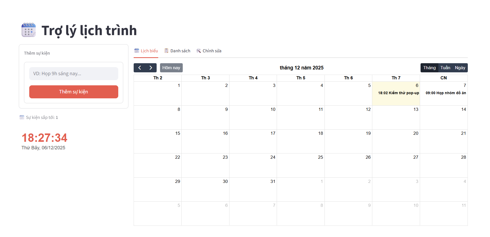
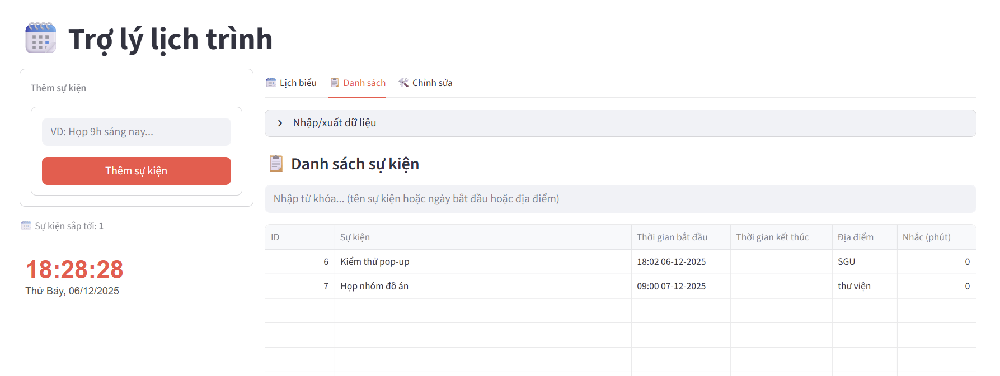
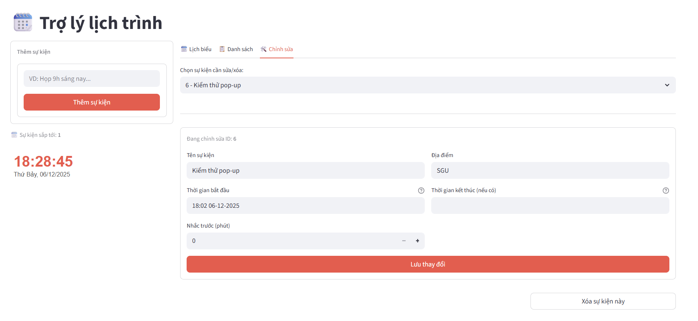

# 🗓️ Trợ lý Quản lý Lịch trình Cá nhân (Vietnamese Schedule App)



---

## 📖 Giới thiệu

**Vietnamese Schedule App** là ứng dụng quản lý lịch trình cá nhân thông minh chạy trực tiếp trên trình duyệt (localhost). Ứng dụng cho phép người dùng **nói chuyện bằng tiếng Việt tự nhiên** để tạo sự kiện — không cần điền từng ô biểu mẫu thủ công.

Điểm nổi bật:
- Hoạt động hoàn toàn **offline** — không cần kết nối Internet khi sử dụng.
- Sử dụng **mô hình lai (Hybrid NLP Model)** kết hợp học máy (Underthesea) và hệ luật (Regex) để trích xuất thông tin từ câu lệnh.
- Giao diện trực quan với lịch tháng/tuần/ngày, danh sách sự kiện và form chỉnh sửa.
- Hệ thống **nhắc nhở tự động** chạy ngầm, hiển thị pop-up đúng giờ.

---

## ✨ Tính năng chi tiết

### 1. 🧠 Xử lý ngôn ngữ tự nhiên (NLP Engine)

Đây là tính năng cốt lõi của ứng dụng. Người dùng chỉ cần gõ một câu tiếng Việt thông thường, hệ thống sẽ tự động phân tích và trích xuất đầy đủ thông tin sự kiện.

**Những gì hệ thống có thể hiểu:**

| Loại thông tin | Ví dụ đầu vào |
|----------------|---------------|
| Tên sự kiện | "họp nhóm đồ án", "đi ăn tối", "đặt lịch khám" |
| Giờ cụ thể | "9h", "14:30", "7 giờ tối" |
| Ngày tương đối | "hôm nay", "sáng mai", "ngày mốt", "hôm qua" |
| Ngày cụ thể | "15/8", "01-01-2026", "05/12/2025" |
| Thứ trong tuần | "thứ 2", "thứ ba", "thứ 6 tuần sau", "chủ nhật" |
| Giờ kết thúc | "từ 9h đến 11h", "10h tới 12h30" |
| Địa điểm | "tại phòng 302", "ở Highland Coffee" |
| Nhắc trước | "nhắc trước 15 phút", "báo sớm 30p" |

**Câu lệnh mẫu và kết quả trích xuất:**

```
Input:  "Nhắc tôi họp nhóm đồ án tại phòng 302 lúc 9h sáng mai, nhắc trước 15 phút"

Output:
{
  "event": "Họp nhóm đồ án",
  "start_time": "2025-12-07T09:00:00",
  "end_time": null,
  "location": "phòng 302",
  "reminder_minutes": 15
}
```

Thêm ví dụ câu lệnh hợp lệ:
- `"Đi họp lúc 9h sáng mai"` → sự kiện lúc 09:00 ngày hôm sau
- `"Chiều nay 14h30 đến 16h họp dự án tại văn phòng"` → có cả giờ bắt đầu và kết thúc
- `"Thứ 6 tuần sau 8h khám nha khoa, nhắc trước 30 phút"` → tự tính ngày thứ 6 tuần sau
- `"15/8 lúc 10h sinh nhật bạn Minh ở nhà hàng ABC"` → ngày cụ thể 15/08

---

### 2. 📅 Quản lý lịch biểu

**Lịch biểu trực quan (Tab Lịch biểu):**


- Tích hợp **FullCalendar v5** với giao diện tiếng Việt.
- Hỗ trợ 3 chế độ xem: **Tháng / Tuần / Ngày**.
- Hiển thị đầy đủ giờ bắt đầu – kết thúc trên từng ô sự kiện.
- Chỉ báo thời gian hiện tại (`nowIndicator`).
- Màu sắc phân biệt sự kiện họp (đỏ) và sự kiện thông thường (xanh).

**Danh sách sự kiện (Tab Danh sách):**



- Hiển thị toàn bộ sự kiện dưới dạng bảng có cột: ID, Tên, Thời gian bắt đầu, Thời gian kết thúc, Địa điểm, Nhắc (phút).
- **Tìm kiếm nhanh** theo từ khóa (tên sự kiện, ngày tháng, địa điểm).
- **Xuất lịch trình** ra file `.json` để sao lưu.
- **Tải file mẫu** `.json` để tham khảo định dạng nhập liệu thủ công.
- **Nhập dữ liệu** từ file `.json` (hàng loạt) với thanh tiến trình.

**Chỉnh sửa / Xóa sự kiện (Tab Chỉnh sửa):**



- Chọn sự kiện cần sửa qua dropdown (hiển thị `ID - Tên sự kiện`).
- Chỉnh sửa trực tiếp: tên, địa điểm, thời gian bắt đầu, thời gian kết thúc, số phút nhắc.
- Định dạng nhập thời gian: `HH:MM DD-MM-YYYY` (VD: `14:30 05-12-2025`).
- Xóa sự kiện với nút **Xóa** riêng biệt.

---

### 3. 🔔 Hệ thống nhắc nhở tự động

- Chạy như một **Background Thread** ngầm, kiểm tra lịch mỗi **5 giây**.
- Khi đến giờ nhắc (= giờ sự kiện − số phút nhắc trước), hệ thống hiển thị:
  - **Windows:** Pop-up `MessageBoxW` qua Windows API (`ctypes`).
  - **macOS / Linux:** In ra console (terminal).
- **Chống lặp thông báo:** Mỗi sự kiện chỉ nhắc đúng một lần; nếu người dùng cập nhật giờ hoặc số phút nhắc, hệ thống sẽ nhắc lại với thông tin mới.
- Tự động dọn dẹp bộ nhớ trạng thái khi sự kiện bị xóa.

---

### 4. ⚠️ Phát hiện xung đột lịch

Khi thêm sự kiện mới, hệ thống tự động kiểm tra xem có trùng giờ với sự kiện đã có hay không bằng thuật toán:

```
Sự kiện A và B xung đột khi: (Start_A < End_B) AND (End_A > Start_B)
```

> Nếu sự kiện không có giờ kết thúc, hệ thống mặc định coi sự kiện kéo dài **60 phút** để kiểm tra.

- Nếu phát hiện xung đột: hiển thị **cảnh báo màu vàng** kèm tên các sự kiện bị trùng — vẫn cho phép lưu.
- Nếu không xung đột: hiển thị **thông báo thành công màu xanh**.

---

### 5. 💾 Lưu trữ & Sao lưu dữ liệu

**Cơ sở dữ liệu SQLite (`schedule.db`)** — tự động tạo khi chạy lần đầu:

| Cột | Kiểu | Mô tả |
|-----|------|-------|
| `id` | INTEGER | Khoá chính, tự tăng |
| `event_name` | TEXT | Tên sự kiện |
| `start_time` | TEXT | Thời gian bắt đầu (ISO 8601) |
| `end_time` | TEXT | Thời gian kết thúc (có thể NULL) |
| `location` | TEXT | Địa điểm (có thể NULL) |
| `reminder_minutes` | INTEGER | Số phút nhắc trước (mặc định 0) |

**Sao lưu & Khôi phục qua file JSON:**

Định dạng file:
```json
[
  {
    "event": "Họp nhóm đồ án",
    "start_time": "2025-11-01T10:00:00",
    "end_time": null,
    "location": "Phòng 302",
    "reminder_minutes": 15
  }
]
```

- **Xuất:** Tải toàn bộ lịch trình ra file `full_backup.json`.
- **Nhập:** Upload file `.json`, hệ thống kiểm tra tính hợp lệ và nhập hàng loạt.

---

## 🛠️ Công nghệ sử dụng

| Thành phần | Công nghệ / Thư viện | Phiên bản |
|---|---|---|
| **Ngôn ngữ** | Python | 3.8+ |
| **Giao diện** | [Streamlit](https://streamlit.io/) | 1.51.0 |
| **Lịch biểu** | [FullCalendar](https://fullcalendar.io/) | 5.11.3 (CDN) |
| **NLP — Học máy** | [Underthesea](https://github.com/underthesea/underthesea) | 8.3.0 |
| **NLP — Hệ luật** | Python `re` (Regex) | built-in |
| **Cơ sở dữ liệu** | SQLite3 | built-in |
| **Xử lý dữ liệu** | pandas | 2.3.3 |
| **Nhắc nhở (Windows)** | `ctypes` (Windows API) | built-in |

---

## 📂 Cấu trúc dự án

```
VietnameseScheduleApp/
├── app.py              # Giao diện Streamlit, luồng nhắc nhở, xử lý form
├── database.py         # Kết nối SQLite: khởi tạo, CRUD, kiểm tra xung đột
├── nlp_engine.py       # NLP Engine: tiền xử lý, NER, Regex, phân tích thời gian
├── requirements.txt    # Danh sách thư viện phụ thuộc
├── schedule.db         # File CSDL SQLite (tự sinh khi chạy app)
├── images/             # Ảnh minh họa cho README
│   ├── HomePage.png
│   ├── LisTab1.png
│   ├── ListTab2.png
│   └── EditTab.png
└── README.md           # Tài liệu hướng dẫn (file này)
```

---

## 🚀 Hướng dẫn cài đặt & chạy ứng dụng

### Yêu cầu hệ thống
- **Python** 3.8 trở lên
- **pip** (trình quản lý gói Python)
- Kết nối Internet lần đầu (để `underthesea` tải model NLP)

---

### Bước 1: Clone dự án về máy

```bash
git clone https://github.com/MinhTriTech/VietnameseScheduleApp.git
cd VietnameseScheduleApp
```

### Bước 2: Tạo môi trường ảo (khuyến nghị)

**Windows:**
```bash
python -m venv venv
.\venv\Scripts\activate
```

**macOS / Linux:**
```bash
python3 -m venv venv
source venv/bin/activate
```

### Bước 3: Cài đặt thư viện

```bash
pip install -r requirements.txt
```

> ⚠️ Lần đầu cài đặt `underthesea` có thể mất vài phút do tải model ngôn ngữ tiếng Việt.

### Bước 4: Chạy ứng dụng

```bash
streamlit run app.py
```

Ứng dụng sẽ tự động mở tại: **`http://localhost:8501`**

---

## 🔍 Cơ chế xử lý NLP — Hybrid Model (5 bước)

Pipeline trong `nlp_engine.py` hoạt động qua 5 bước tuần tự:

```
Câu nhập liệu
      │
      ▼
┌─────────────────────────────────────┐
│  Bước 1: Tiền xử lý                 │
│  - Chuẩn hóa chuỗi (strip, lower)  │
│  - Word Tokenization (Underthesea)  │
└───────────────────┬─────────────────┘
                    │
                    ▼
┌─────────────────────────────────────┐
│  Bước 2: Trích xuất thực thể (NER)  │
│  - Model Underthesea nhận diện LOC  │
│  - Lấy chuỗi địa điểm (nếu có)     │
└───────────────────┬─────────────────┘
                    │
                    ▼
┌─────────────────────────────────────┐
│  Bước 3: Hệ luật (Rule-Based)       │
│  - Regex trích xuất nhắc nhở        │
│    "nhắc trước X phút / báo sớm Xp" │
│  - Regex fallback cho địa điểm      │
│    "tại ...", "ở ..."               │
│  - Tách tên sự kiện khỏi thời gian  │
└───────────────────┬─────────────────┘
                    │
                    ▼
┌─────────────────────────────────────┐
│  Bước 4: Phân tích thời gian        │
│  - Ngày tuyệt đối: "15/8", "1-1"    │
│  - Ngày tương đối: "mai", "mốt",    │
│    "hôm qua", "tuần sau"            │
│  - Thứ trong tuần: "thứ 2", "CN"    │
│  - Giờ: "9h", "14:30", "tối"        │
│  - Giờ kết thúc: "đến 11h"          │
└───────────────────┬─────────────────┘
                    │
                    ▼
┌─────────────────────────────────────┐
│  Bước 5: Kiểm tra & đóng gói        │
│  - Validate giờ/phút hợp lệ         │
│  - Chặn sự kiện trong quá khứ       │
│  - Kiểm tra end_time > start_time   │
│  - Trả về dict JSON chuẩn           │
└─────────────────────────────────────┘
```

**Kết quả trả về** là một `dict` với cấu trúc:
```python
{
    "event": str,           # Tên sự kiện
    "start_time": str,      # ISO 8601 hoặc None nếu không xác định được
    "end_time": str,        # ISO 8601 hoặc None
    "location": str,        # Địa điểm hoặc chuỗi rỗng
    "reminder_minutes": int,# Số phút nhắc trước (mặc định 0)
    "error": str            # Thông báo lỗi (nếu có) hoặc None
}
```

---

## ⚠️ Lưu ý quan trọng

| Vấn đề | Chi tiết |
|--------|---------|
| **Pop-up thông báo** | Sử dụng `ctypes.windll.user32.MessageBoxW` — chỉ hoạt động trên **Windows**. Trên macOS/Linux, nhắc nhở sẽ được in ra terminal. |
| **Model NLP** | Lần đầu chạy, `underthesea` tự tải model tiếng Việt — cần kết nối mạng. Từ lần hai trở đi hoạt động offline hoàn toàn. |
| **Sự kiện quá khứ** | Hệ thống từ chối lưu sự kiện có thời gian đã trôi qua và trả về thông báo lỗi. |
| **Thư viện** | Không được thay đổi phiên bản `underthesea` hoặc `streamlit` tùy tiện vì có thể gây xung đột API. |

